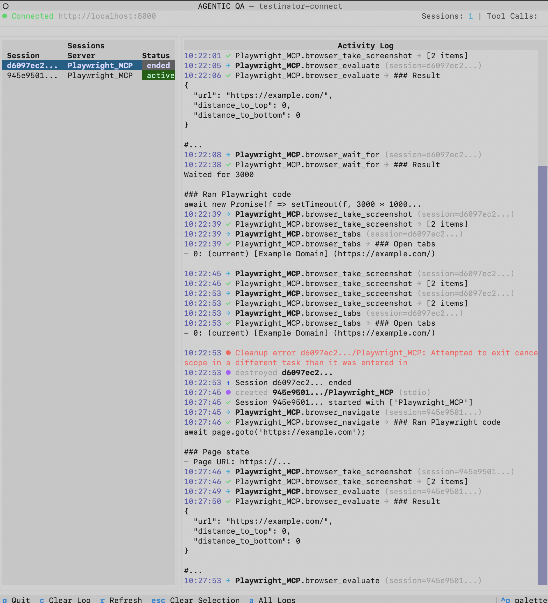

# testinator-connect

Connect local MCP servers (like Playwright MCP) to a remote testinator-tooling instance via Socket.IO.

## Screenshot

<!-- TODO: Add screenshot of TUI dashboard -->


## Requirements

The following repositories must be on the `feature/alita_mcp` branch:

| Repository | Branch |
|------------|--------|
| testinator-python-agents-runner | `feature/alita_mcp` |
| testinator-executor | `feature/alita_mcp` |
| testinator-tooling | `feature/alita_mcp` |

## Installation

```bash
cd testinator_connect
uv sync
```

## Configuration

1. Copy the example configuration:
   ```bash
   cp config.example.json config.json
   ```

2. Edit `config.json` with your settings:
   ```json
   {
     "deployment_url": "URL_OF_YOUR_TOOLING_INSTANCE",
     "auth_token": "NOT_USED_NOW",
     "timeout": 120,
     "ssl_verify": false,
     "servers": {
       "Playwright_MCP": {
         "type": "stdio",
         "command": "npx",
         "args": [
           "@playwright/mcp@latest",
           "--caps", "vision",
           "--image-responses", "allow",
           "--viewport-size", "1280x720",
           "--timeout-action", "60000",
           "--isolated"
         ],
         "stateful": true
       }
     }
   }
   ```

### Playwright MCP Options

| Option | Description |
|--------|-------------|
| `--caps vision` | Enable vision/screenshot capabilities |
| `--image-responses allow` | Allow image data in responses |
| `--viewport-size WxH` | Browser viewport dimensions (must match the Workflow's session viewport size) |
| `--timeout-action N` | Action timeout in milliseconds |
| `--isolated` | Run browser in isolated mode |

## Usage

### TUI Dashboard (Default)

```bash
uv run testinator-connect serve
```

Launches an interactive TUI dashboard with:
- **Sessions panel**: Track active and ended sessions with status badges
- **Activity log**: Real-time tool call logging with timestamps
- **Session filtering**: Click a session to filter logs, press `a` or `Escape` to show all
- **Connection status**: Visual indicator showing connection state

### Keyboard Shortcuts

| Key | Action |
|-----|--------|
| `q` | Quit |
| `c` | Clear log |
| `r` | Refresh sessions |
| `a` | Show all logs |
| `Escape` | Clear session selection |

### Plain Console Mode

```bash
uv run testinator-connect serve --no-tui
```

Runs without the TUI dashboard, using simple console output instead.

## Configuration Options

| Option | Type | Description |
|--------|------|-------------|
| `deployment_url` | string | URL of testinator-tooling instance |
| `auth_token` | string | Authorization token |
| `timeout` | integer | Tool call timeout in seconds (default: 120) |
| `ssl_verify` | boolean | Enable SSL verification (default: false) |
| `servers` | object | Dictionary of MCP server configurations |


## How It Works

```
┌─────────────────────┐     Socket.IO      ┌─────────────────────┐
│                     │◄──────────────────►│                     │
│  testinator-tooling │                    │  testinator-connect │
│      (remote)       │   tool calls &     │      (local)        │
│                     │     results        │                     │
└─────────────────────┘                    └──────────┬──────────┘
                                                      │
                                                      │ stdio
                                                      ▼
                                           ┌─────────────────────┐
                                           │                     │
                                           │    Playwright MCP   │
                                           │     (subprocess)    │
                                           │                     │
                                           └──────────┬──────────┘
                                                      │
                                                      │ browser
                                                      ▼
                                           ┌─────────────────────┐
                                           │                     │
                                           │   Chromium Browser  │
                                           │                     │
                                           └─────────────────────┘
```

1. **Startup**: testinator-connect loads config, spawns Playwright MCP subprocess, discovers available tools, connects to testinator-tooling via Socket.IO, and registers tools.

2. **Tool Execution**: When testinator-tooling requests a tool call, testinator-connect routes it to Playwright MCP and returns the result (including screenshots).

3. **Stateful Sessions**: Browser state persists between tool calls for faster execution and session continuity.

## Troubleshooting

### Browser specified in your config is not installed

If a tool call fails with:

```
Error: Browser specified in your config is not installed. Either install it (likely) or change the config.
```

Playwright MCP is running but its browser binary is missing. Install Chromium for the pinned Playwright MCP version:

```bash
npx -y --package=@playwright/mcp@0.0.61 playwright install chromium
```

Match the version to whatever `@playwright/mcp` version your `config.json` resolves to (the example above pins `@playwright/mcp@latest`, so re-run this whenever that version bumps).
